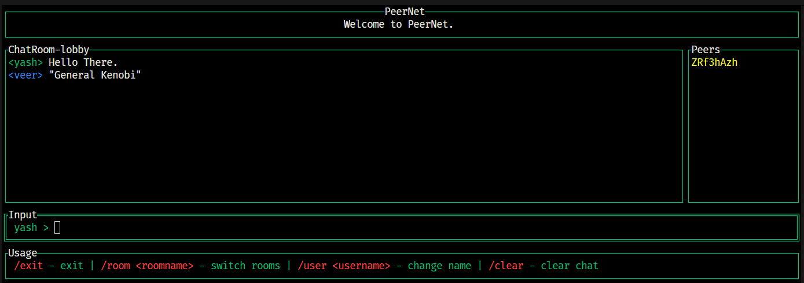

# PeerNet - A P2P Chat Application

### Overview
PeerNet is a peer-to-peer chat application built using libp2p. The application allows multiple peers to join specific chat rooms and exchange messages in real-time using a PubSub mechanism. It supports dynamic peer discovery and allows users to switch rooms during a chat session.

This project uses the `go-libp2p` library for handling networking and the `tview` package for building a terminal-based user interface.

### Features
- **P2P Networking:** Real-time message broadcasting and receiving using libp2p PubSub.
- **Dynamic Rooms:** Ability to join different chat rooms dynamically.
- **Terminal UI:** Text-based UI built using tview for an interactive chat experience.
- **Peer List:** Real-time updates of connected peers in the chat room.

### Demo


### Installation
1. **Clone the repository:**

```
git clone https://github.com/yaxhveer/peernet.git
cd peernet
```

2. **Install dependencies:**

Install the required Go packages:

```
go mod tidy
```

3. **Build the project:**
```
go build -o peernet .
```

### Usage

After building the project, one can run the application using:
```
./peernet -user="yaxh" -room="hub"
```

### Flags
- `-user <username>`:  Specifies the username you want to use in the chat room. Default is "user".
- `-room <roomname>`: Specifies the chat room to join. Default is "lobby".
- `-discover <method>`: Specifies the peer discovery method. Possible values are "announce", "advertise". Default is "advertise".
